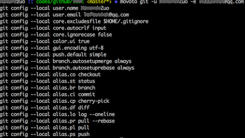
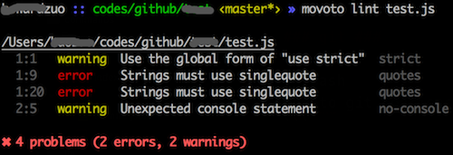
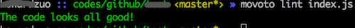

## commands ##

**Command line reference**

* [git](#git)
* [lint](#lint)


### git ###

```bash
movoto git <options>
```

**git options**

* `-u`, `--username`: Username will be displayed in `git log`
* `-e`, `--email`: Email will be displayed in `git log`

Config `git` for the local repo, including `alias`, `ui`, `encoding`...



### lint ###

```bash
movoto lint <filePath>
```

Lint your JavaScript source code.

* `filePath`: Can be either explicit file path, or [glob-pattern](https://github.com/isaacs/node-glob#glob-primer)



