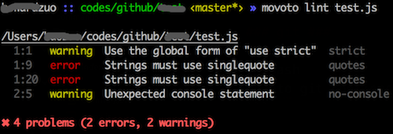
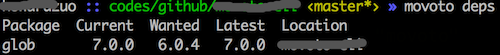

## commands ##

**Command line reference**

* [git](#git)
* [lint](#lint)
* [server](#server)
* [deps](#deps)


### git ###

```bash
movoto git <options>
```

**git options**

* `-u`, `--username`: Username will be displayed in `git log`
* `-e`, `--email`: Email will be displayed in `git log`

Config `git` for the local repo, including `alias`, `ui`, `encoding`...


### lint ###

```bash
movoto lint [filePath] [options]
```

Lint your JavaScript source code.

* `filePath`: Can be either explicit file path, or [glob-pattern](https://github.com/isaacs/node-glob#glob-primer)

>You have to make sure the `glob-pattern` to be quoted if you use it.

**lint options**

* `-u`, `--unstaged`: lint not staged files. If you have code to be committed to git server, you can use this option instead of using `fileGlob` to specify every file
* `-e`, `--env`: which environments your script is designed to run in. Available choices [`browser`, `node`]. `node` is used by default.



### server ###

```bash
movoto server [options]
```

**server options**

* `-p`, `--port`: Use a specific port for the server
* `-m`, `--html5`: Enable html5 mode, which respond with index.html for 404 request

Serve current repo as static web server.


### deps ###

```bash
movoto deps
```

Check if there is any update available dependencies for current package.json.


