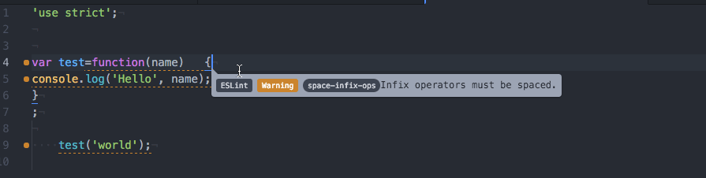

## IDE support ##

**Command line reference**

* [atom](#atom)


### atom ###

>[atom](https://atom.io/) is recommended IDE

#### Install Atom ####

**on windows**

1. download latest version of [atom](https://atom.io/)
2. unzip it

**on ubuntu**

```bash
sudo add-apt-repository ppa:webupd8team/atom
sudo apt-get update
sudo apt-get install atom
```

**on osx**

1. Make sure [HomeBrew](#homebrew) is installed

```bash
brew cask install atom
```

#### Configure Atom ####

```bash
curl -L https://raw.githubusercontent.com/leftstick/movoto-cli/master/docs/scripts/atom_plugin.sh | sh
```

>If you are running it on unix like os, it may ask you for sudo password

At last, you may choose what `eslint` configuration file you'd like to use.

**If you are coding for browser(no modularization - in other words no webpack, browerify involved), execute following:
**

```bash
cat ~/.eslintrc_browser > ~/.eslintrc
```

**If you are coding in commonjs module way(node env, or with webpack, browserify involved), execute following:**

```bash
cat ~/.eslintrc_node > ~/.eslintrc
```

OK, all configuration are done! Now, try launching your atom, and have fun with auto-formatter and auto-linting as following:




### Install HomeBrew ###

```bash
/usr/bin/ruby -e "$(curl -fsSL https://raw.githubusercontent.com/Homebrew/install/master/install)"
brew install caskroom/cask/brew-cask
```
